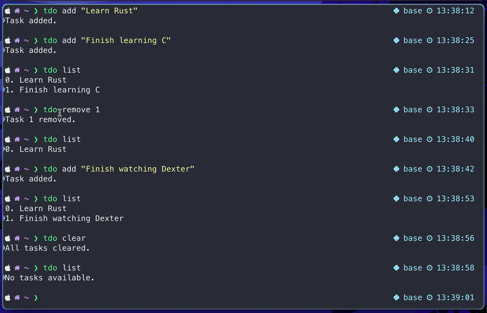

# Tdo

Tdo is a simple to-do list/task manager built using C. It has four commands `tdo add [task]`, `tdo remove [index of task]`, `tdo list` and `tdo clear`

# Image

An image of how tdo works

# Installation

To install fork the repository and add it to your path to use `tdo` globally from anywhere in the command line

## For Bash users

Copy and paste `export PATH=$PATH:/path/to/your/program` in your `~/.bashrc` file. Make sure to change /path/to/your/program to the path where you installed Tdo. Then reload the file with `source ~/.bashrc`

## For Zsh users

Copy and paste `export PATH=$PATH:/path/to/your/program` in your `~/.zshrc` file. Make sure to change /path/to/your/program to the path where you installed Tdo. Then reload the file with `source ~/.zshrc`
 
This is how it should look

